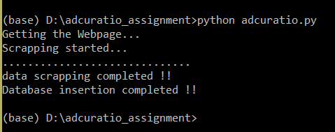

# Adcuratio Assignment Solution : Sunil Kumar Jain

Below are the steps to run the adcuratio.py and scrap the data from the [link](https://news.ycombinator.com/)

#### Installing the dependencies
- Make sure you have python3 installed. 
- Installing the **requests** module to make URL request. <br />
 ``` pip install requests ```<br />
 - Installing the **BeautifulSoup** module to scrap the data. <br />
 ``` pip install beautifulsoup4 ```<br />
 - Installing the **pymongo** module to connect to MongoDB. <br />
 ``` pip install pymongo ```<br />
 
 #### Running the Script
 - Download the repository or use the command <br />
 ``` git clone https://github.com/sunilsj99/adcuratio-assignment.git ```
 - Open the terminal inside the source folder and use command<br />
 ``` python adcuratio.py ```
 
 #### Output 
 
